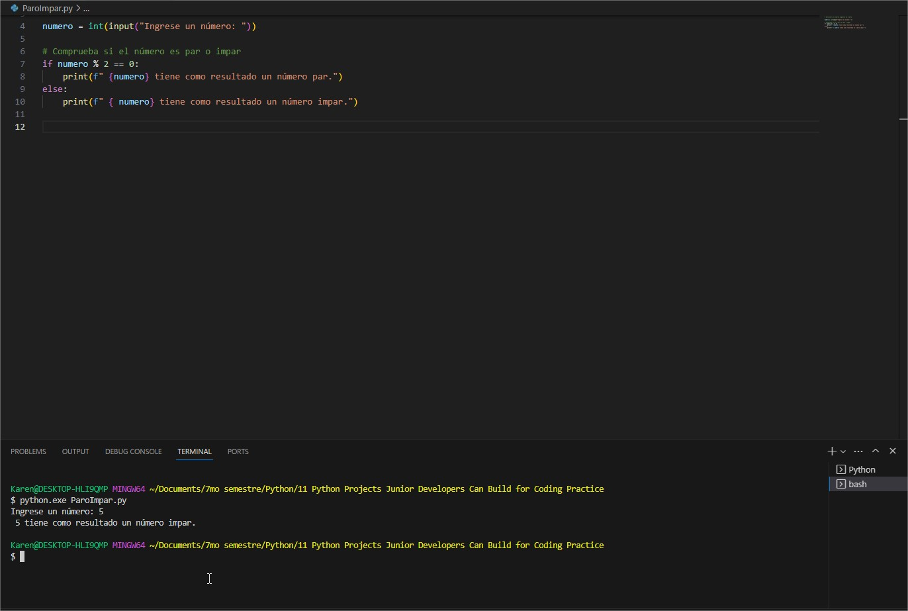

# Ejercicios en Python

Este repositorio contiene una serie de ejercicios en Python para practicar habilidades de programación. Cada ejercicio aborda un problema diferente.

## Ejercicios

1. **Par o Impar:** Verifica si un número ingresado por el usuario es par o impar.

2. **Juego del Mad Lib:** Un juego de completar frases basado en las entradas del usuario.

3. **Contador de Palabras:** Cuenta cuántas palabras hay en una oración ingresada por el usuario.

4. **Información de la Biografía:** Recopila información personal del usuario y la muestra como un resumen.

5. **¿Cuál es mi Acrónimo?:** Convierte una frase en un acrónimo.

6. **Rock, Paper, Tijeras:** Juego simple de "piedra, papel o tijeras" en el que se compite contra la computadora.

7. **Adivina el Número Oculto:** Adivina un número oculto generado aleatoriamente por la computadora.

8. **Es Palíndromo:** Verifica si una palabra es un palíndromo.

9. **Calculador de Propinas:** Calcula la propina y el total de una factura.

10. **Extractor de Información del Correo Electrónico:** Extrae información de una dirección de correo electrónico.

11. **Generador de Letras:** Muestra la letra de una canción seleccionada por el usuario.

## Cómo ejecutar los ejercicios

1. Asegúrate de tener Python instalado. Puedes descargarlo desde [python.org](https://www.python.org/downloads/).

2. Abre una terminal o línea de comandos y navega al directorio donde tengas los archivos de los ejercicios.

3. Ejecuta cada ejercicio utilizando el comando `python nombre_del_ejercicio.py`. Reemplaza `nombre_del_ejercicio.py` con el nombre del archivo del ejercicio que deseas ejecutar.

